# Resume

iOS Developer

- 이름 : 정해현 
- 연락처 : 010-2543-6349
- Email : wjdgo50@gmail.com
- Github : https://github.com/wjdgo813

## 보유 기술

iOS, Swift, RxSwift, SwiftUI, Combine

## 경력

[Kakao Mobility](https://www.kakaomobility.com/)

- 2019.8 ~ now

[AfreecaTV](http://www.afreecatv.com/)
- 2016.3 ~ 2019.7

## 회사 프로젝트
#### Kakao mobility

- 역할: iOS T 앱 개발

- 사용기술: RxSwift, MVVM, Swift UI, Combine

- [AppStore](https://apps.apple.com/kr/app/%EC%B9%B4%EC%B9%B4%EC%98%A4-t/id981110422)

- 업무내용

  - 바이크 UI 개편

  - 킥보드 채널링 추가

    - MVVM, 1:N으로 2개 이상의 ViewModel 적용 

    - View 단에서는 ViewModel의 프로토콜에 접근하도록 하여 ViewModel 내부 구현체와의 디펜던시 분리

    - > 기존 바이크와는 다른 킥보드라는 완전히 새로운 기능이 추가되는 프로젝트였습니다. 
      >
      > 서로 View는 공유하지만 비지니스 로직이 완전히 다른 프로젝트였습니다.
      >
      > 자칫하면 기존 바이크에도 디펜던시가 생길 수 있었습니다. 그렇다고 디펜던시를 완전히 분리해버리면 똑같은 View가 두 개씩 작업되는 비효율적인 상황이 올 수 있었습니다. 
      >
      > 이를 방지하기 위하여 View 단은 서로 공유하지만 비지니스 로직의 디펜던시는 서로 완전히 절단하였습니다.
      >
      > View와 ViewModel이 1:N 구조로 작업을 진행하였고, View는 ViewModel의 프로토콜에 접근하여 ViewModel 내부 구현체와의 디펜던시를 분리하여 킥보드의 ViewModel이던 바이크의 ViewModel이던 상관 없도록 프로젝트를 진행하였습니다.

    

  - 블루투스 모듈 리팩토링 

    - 각 모듈간의 역할에 맡게 레이어 단위로 리팩토링 진행 

    - > 카카오 바이크는 스마트락이라는 외부 블루투스 기기와 통신이 중요한 사항입니다. 블루투스 기기가 업체 별로 프로토콜이 모두 달라 이에 대한 디펜던시의 관리가 중요합니다.
      >
      > 리팩토링에 있어서 아래 2가지의 컨셉을 명확히 지켰습니다.
      >
      > - 모듈의 계층화
      > - 모듈의 단방향 구조 변경
      >
      > UI단부터 블루투스 모듈까지 계층을 분리하였습니다. 각 계층 간에는 모두 Dependency Injection을 충실하게 지켰고, 계층 간의 통신은 protocol화 시켜 모두 단방향의 구조로 변경하였습니다. 
      >
      > 그래서 계층 중간에 어떠한 수정이나 혹은 새로운 계층이 추가가 된다 하더라도 단방향 구조 덕분에 인접한 계층 간에는 영향이 전혀 없도록 작업을 진행하였습니다.

  - 핀 클러스터링

    - 맵에 그리는 수많은 핀들을 클러스터링을 통해 최적화 진행 

    - Hierarchical Clustering 알고리즘 적용

      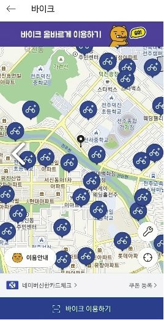

  - 글로벌 택시

  - 렌터카 프로젝트

    - RxSwift + MVVM
    - Server State와 Scene State 1:1 동기화 

    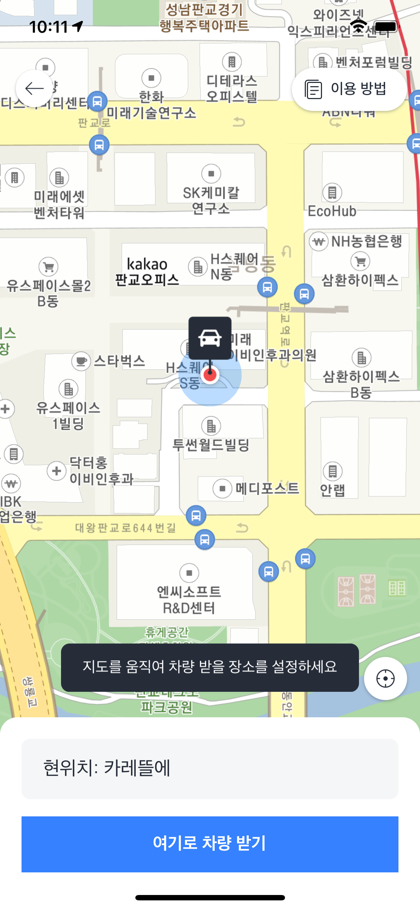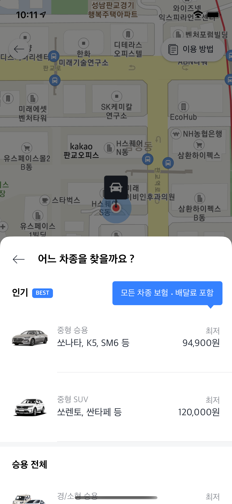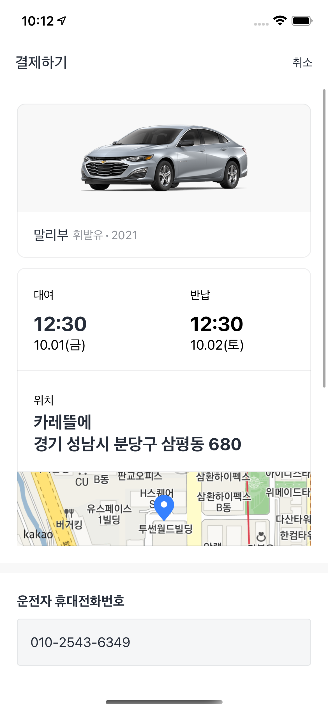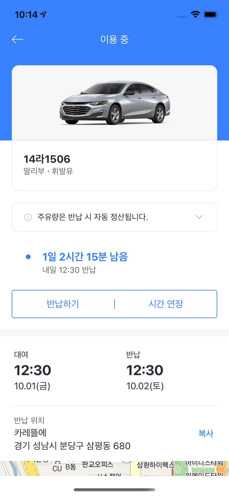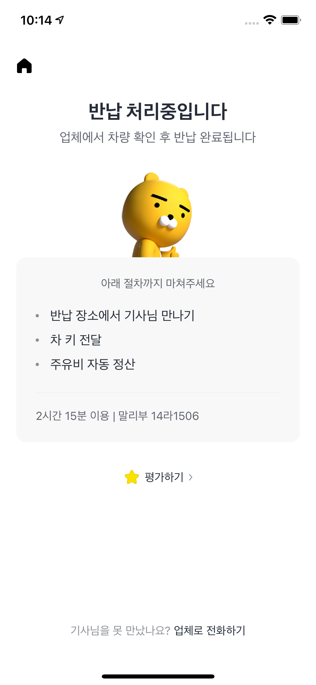

#### AfreecaTV 

- 역할 : iOS 앱 개발
- 사용기술 : Swift, Objective - C, Realm, RxSwift
- [AppStore](https://itunes.apple.com/kr/app/%EC%95%84%ED%94%84%EB%A6%AC%EC%B9%B4tv-afreecatv-korean/id334185830?mt=8)
- 업무내용
  - 라이브 플레이어 개편 (2019.01 ~ 진행중) 
    - RxSwift를 이용하여 커스텀 액션 시트 작업
    - UIViewControllerAnimatedTransitioning, UIViewControllerTransitioningDelegate 구현하여 ViewController present 애니메이션 구현
  - Siri shortcut 추가 (2018.12 ~ 2019.01)
    - Siri shortcut을 이용하여 방송 접속 동선 추가
  - 동영상 통계 그래프 작업 (2018.08 ~ 2018.12)
    - UIBezierPath()를 이용하여 그래프 View 구현
  - For U 개인화 리스트 2차 개편 작업 (2018.07 ~ 2018.09)
    - VIPER 아키텍쳐 적용하며 기존 MVVM 코드 리팩토링
    - POP 적용
    - SnapKit 적용
  - 아이폰X 화면 대응 (2018.01 ~ 2018.03)
    - Safe Area 대응
  - For U 개인화 리스트 작업 (2017.09 ~ 2017.12)
    - MVVM 적용
  - 라이브 방송 포스터치 기능 추가 (2017.07 ~ 2017.09)
    - Peek and Pop 기능 이용하여 방송 미리보기 기능 추가
    - AVPlayer로 HLS 영상 재생
  - 동영상 개편 작업 (2017.04 ~ 2017.07)
    - AVPlayer, CollectionViewController
  - 라이브 플레이어 구조 수정 (2016.09 ~ 2016.12)
    - MRC -> ARC 작업
  - 동영상 댓글 개편 (2016.06 ~ 2016.09)
    - UICollectionViewDelegate, UICollectionViewDataSource

   

## 활동 내역

[if(Kakao) 2021](https://if.kakao.com/session/132)

- 2021/11/18
- 카카오모빌리티 iOS 토크쇼

[NEXTERS](https://www.facebook.com/Nexterspage/) 11th CEO

- 2017/09 ~ 2018/03
- 디자이너와 개발자가 함께 모여 프로젝트를 진행하는 IT 단체입니다.

[UNITHON](https://www.facebook.com/unithonWithU/) 6th 운영진

- 2017/10 ~ 2018/02
- IT 동아리들이 모여 진행하는 대학생 연합 해커톤입니다.

## 개인 프로젝트

##### 아맞다

여행 준비물 체크리스트 서비스

- 기간 : 2019.01 ~ 진행중 
- 사용기술 : Swift, RxSwift, Realm, SnapKit
- 아키텍쳐 : MVC, MVVM
- [Github Repository](https://github.com/Nexters/Amatda-iOS)

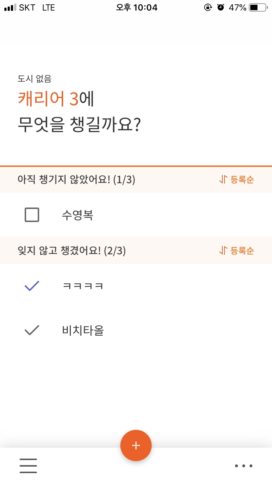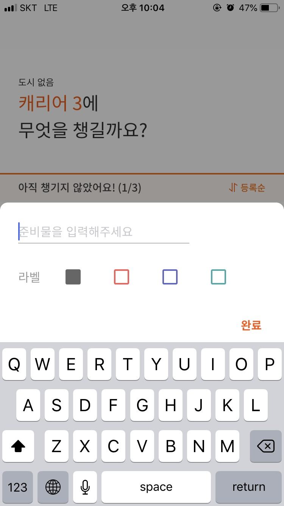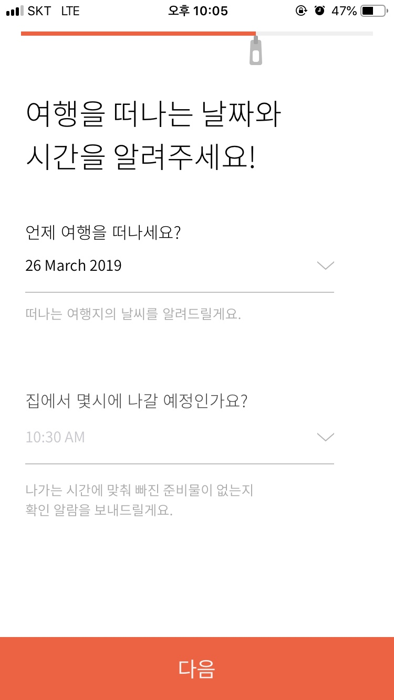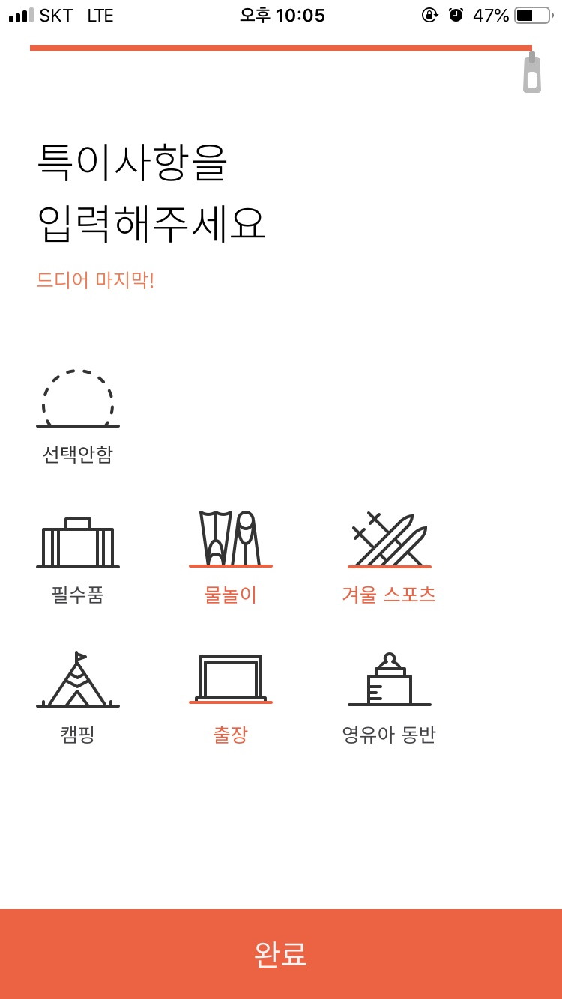

##### TipTap

여행지에서 쉽게 남길 수 있는 일기 앱

- 기간 : 2018.06 ~ 2019.01
- 사용기술 : Swift, RxSwift
- 아키텍쳐 : MVC, MVVM, VIPER
- [AppStore](https://itunes.apple.com/kr/app/tiptap/id1439433799?mt=8)
- [Github Repository](https://github.com/wjdgo813/TipTap_iOS)

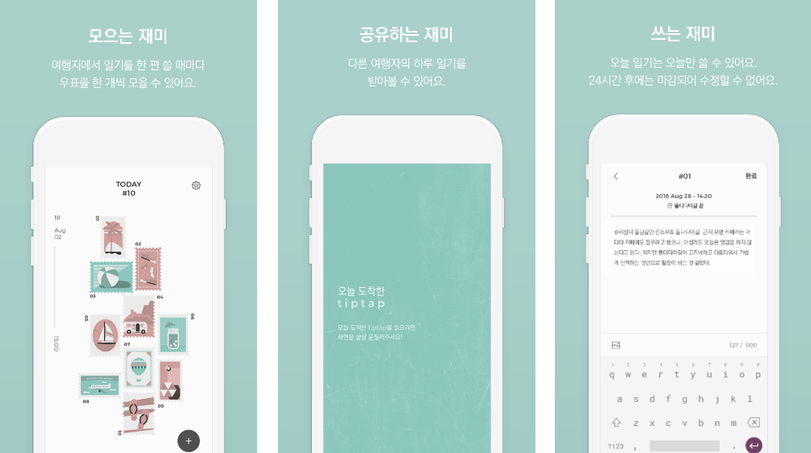

##### 무덤덤

고민을 털어 놓는 익명 SNS 앱 

- 기간 : 2018.01 ~ 2019.03
- 사용기술 : Swift
- 아키텍쳐 : MVC, MVVM
- [AppStore](https://itunes.apple.com/kr/app/%EB%AC%B4%EB%8D%A4%EB%8D%A4-%EC%9D%B5%EB%AA%85-sns-moodumdum/id1380253516?mt=8)
- [Github Repository](https://github.com/wjdgo813/iOS-Moodumdum)

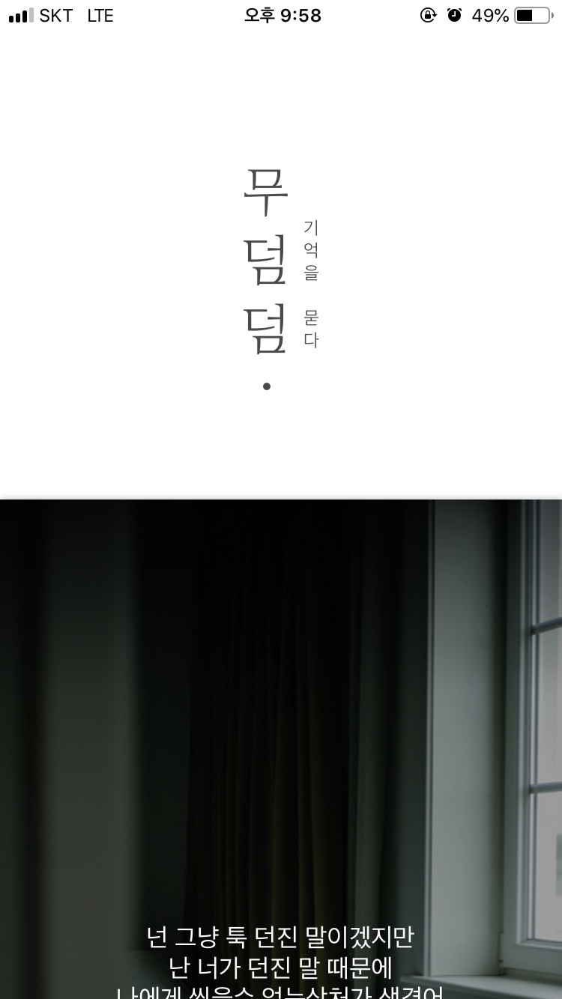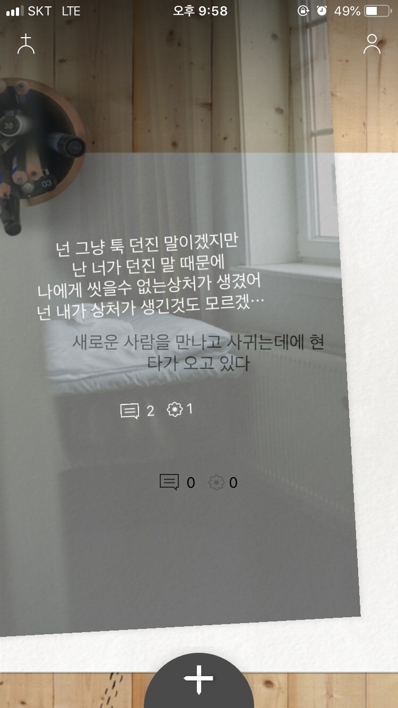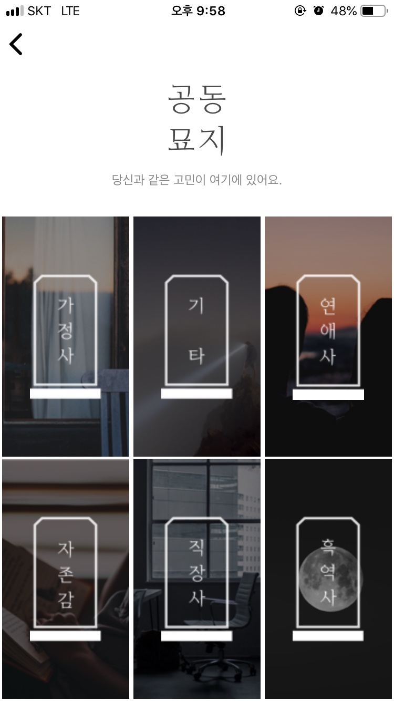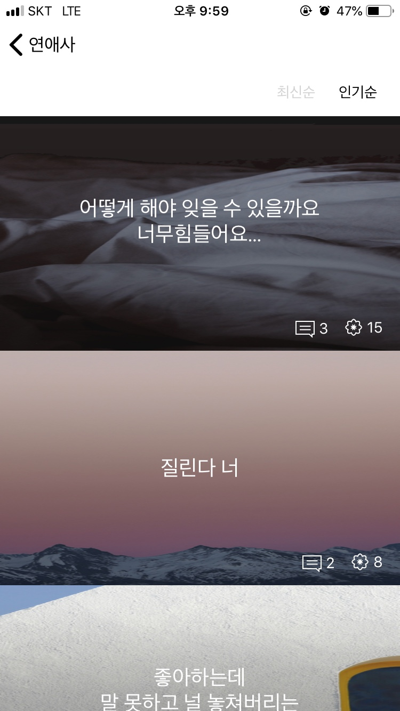

