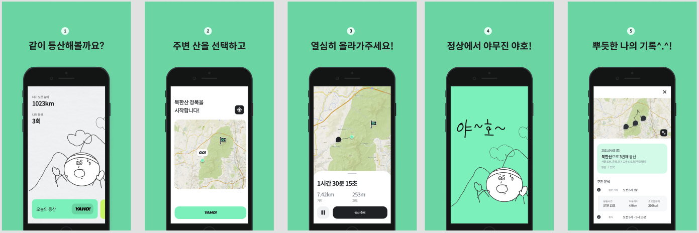
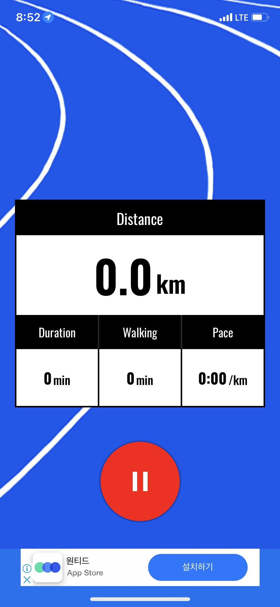
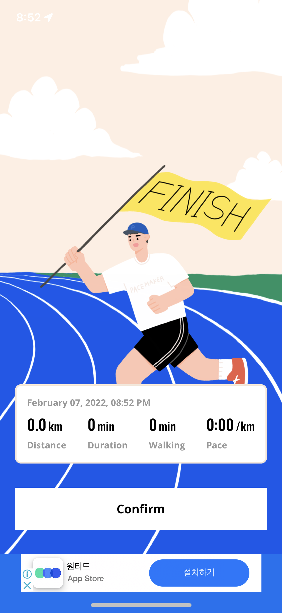
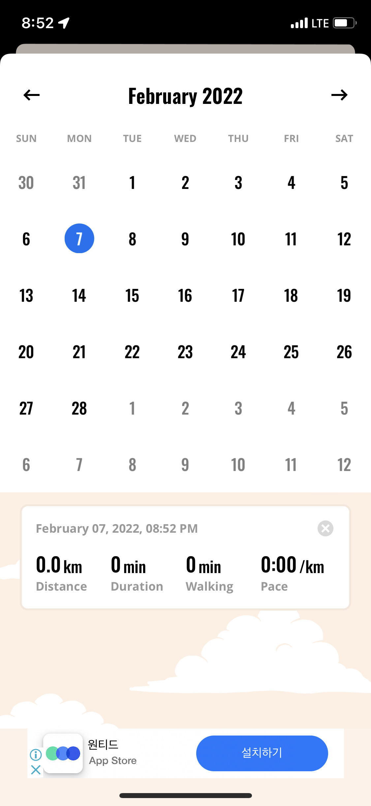
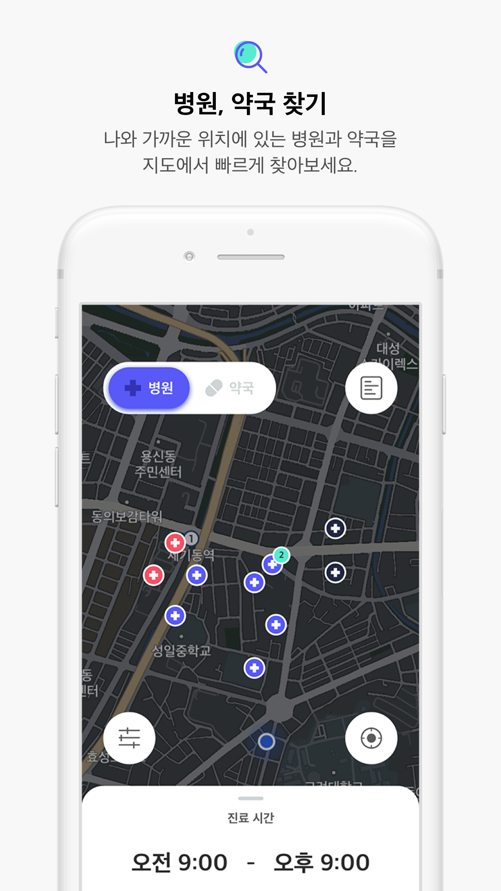
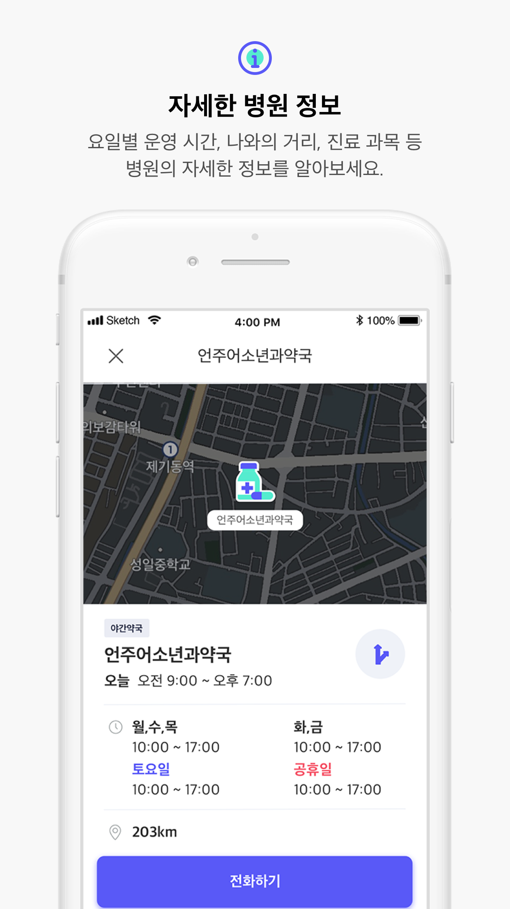
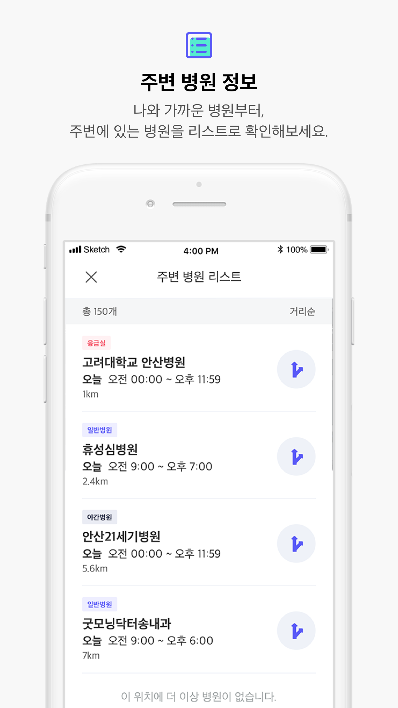
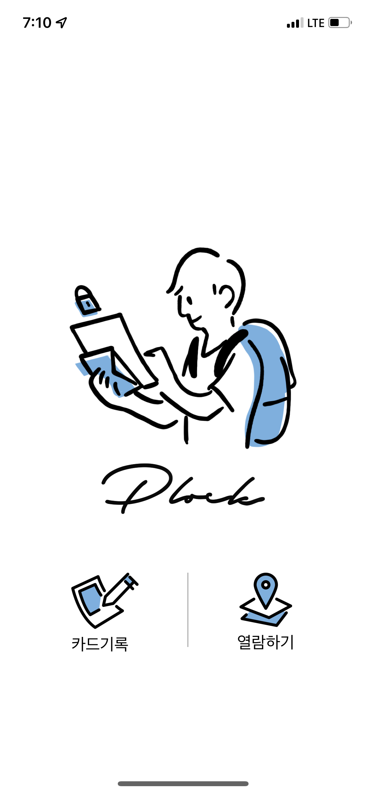
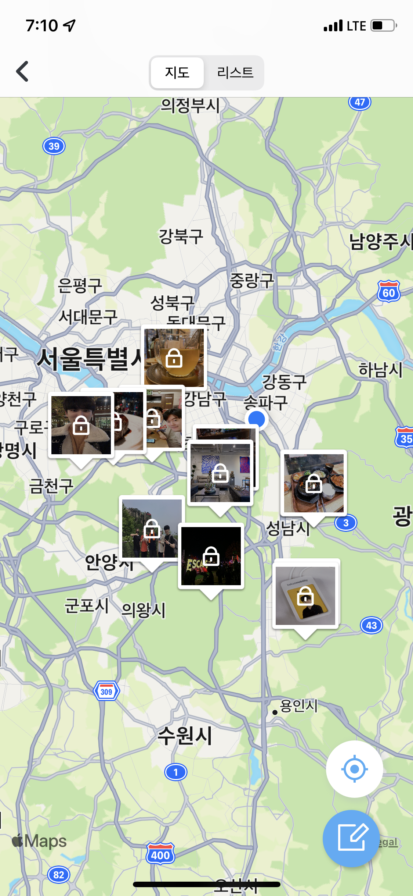
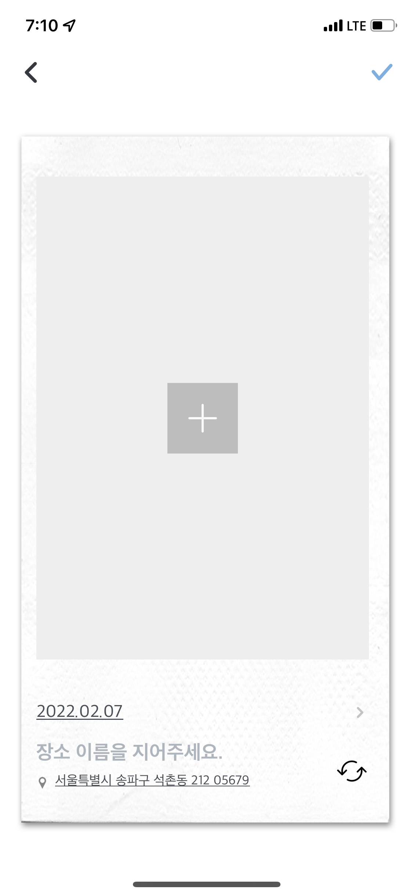

# Resume

iOS Developer

- 이름 : 정해현 
- 연락처 : 010-2543-6349
- Email : wjdgo50@gmail.com
- Github : https://github.com/wjdgo813

## 보유 기술

iOS, Swift, RxSwift, SwiftUI, Combine

## 경력
#### Naver Webtoon

- 기간: 2022.10 ~ now
- 역할: Global webtoon
- 사용기술: RxSwift, Swift, MVVM, ReactorKit

#### Kakao mobility

- 기간: 2019.8 ~ 2020.9
- 역할: KakaoT 앱 개발 
  - 카카오 바이크
  - 카카오 렌터카
  - 카카오 해외택시
  - 카카오 퀵
- 사용기술: RxSwift, MVVM, Swift UI, Combine
- [AppStore](https://apps.apple.com/kr/app/%EC%B9%B4%EC%B9%B4%EC%98%A4-t/id981110422)

#### AfreecaTV 

- 2016.3 ~ 2019.7
- 역할 : iOS 앱 개발
  - 라이브 플레이어 개편
  - VOD 플레이어 개편
- 사용기술 : Swift, Objective - C, Realm, RxSwift
- [AppStore](https://itunes.apple.com/kr/app/%EC%95%84%ED%94%84%EB%A6%AC%EC%B9%B4tv-afreecatv-korean/id334185830?mt=8)

## 활동 내역

[if(Kakao) 2021](https://if.kakao.com/session/132)

- 2021/11/18
- 카카오모빌리티 iOS 토크쇼

[NEXTERS](https://www.facebook.com/Nexterspage/) 11th CEO

- 2017/09 ~ 2018/03
- 디자이너와 개발자가 함께 모여 프로젝트를 진행하는 IT 단체입니다.

[UNITHON](https://www.facebook.com/unithonWithU/) 6th 운영진

- 2017/10 ~ 2018/02
- IT 동아리들이 모여 진행하는 대학생 연합 해커톤입니다.

## 개인 프로젝트

#### yaho

등산 기록 앱

- 기간: 2021.7 ~ 2021.9
- 사용기술: RxSwift, Ribs
- [AppStore](https://apps.apple.com/kr/app/yaho-%EB%93%B1%EC%82%B0-%EA%B8%B0%EB%A1%9D-%EC%95%B1/id1588082150)
- [Github Repository](https://github.com/wjdgo813/yaho)

##### PaceMaker

달리기 기록 앱

- 기간: 2021.3 ~ 2021.5
- 사용기술: RxSwift, MVVM
- [AppStore](https://apps.apple.com/kr/app/pacemaker-running-app/id1564698112)
- [Github Repository](https://github.com/wjdgo813/PaceMaker)

##### 토닥토닥

근처의 병원과 약국 정보를 간단하게 찾을 수 있는 앱

- 기간: 2020.01~ 2020.03
- 사용기술: ReactorKit, Clean Architecture, RxSwift, SnapKit
- [AppStore](https://apps.apple.com/kr/app/%ED%86%A0%EB%8B%A5%ED%86%A0%EB%8B%A5-todoc/id1499183782)
- [Github Repository](https://github.com/Nexters/doctor24_iOS)

##### Plock

장소에 기록하는 사진과 일기 앱

- 기간: 2019.08 ~ 2019.10
- 사용기술: RxSwift, MVVM, SnapKit
- [AppStore](https://apps.apple.com/us/app/plock/id1480478048)
- [Github Repository](https://github.com/Nexters/Plock-iOS)

##### TipTap

여행지에서 쉽게 남길 수 있는 일기 앱

- 기간 : 2018.06 ~ 2019.01
- 사용기술 : Swift, RxSwift
- 아키텍쳐 : MVC, MVVM, VIPER
- [AppStore](https://itunes.apple.com/kr/app/tiptap/id1439433799?mt=8)
- [Github Repository](https://github.com/wjdgo813/TipTap_iOS)

##### 무덤덤

고민을 털어 놓는 익명 SNS 앱 

- 기간 : 2018.01 ~ 2019.03
- 사용기술 : Swift
- 아키텍쳐 : MVC, MVVM
- [AppStore](https://itunes.apple.com/kr/app/%EB%AC%B4%EB%8D%A4%EB%8D%A4-%EC%9D%B5%EB%AA%85-sns-moodumdum/id1380253516?mt=8)
- [Github Repository](https://github.com/wjdgo813/iOS-Moodumdum)

